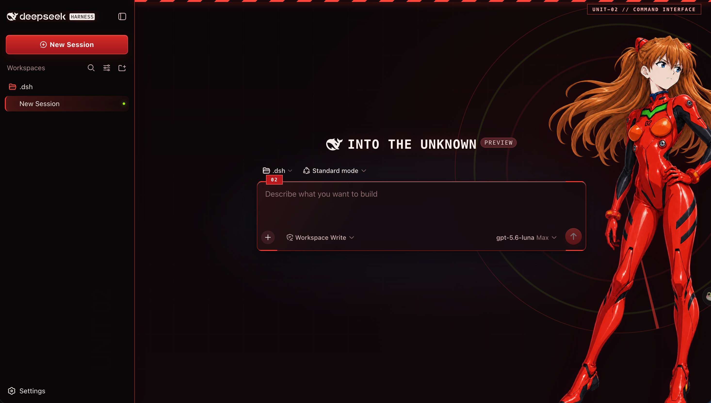

# dsh-skin-asuka

English | [简体中文](README.md)

An Asuka / EVA Unit-02 theme for the DSH Web UI, built around signal red, carbon-black armor panels, sync green, scan lines, and cockpit HUD details.



## Features

- Full Asuka character art and a Unit-02 HUD on the welcome screen.
- The character moves toward the right edge and fades during active chats to preserve readability.
- Light mode, dark mode, narrow viewports, and reduced-motion preferences are supported.
- DOM nodes, title, favicon, and theme-color changes are fully removed when switching skins.
- Character artwork is embedded in the client bundle and requires no remote image server.

## Installation

```sh
dsh plugin --profile web add https://github.com/unpain/dsh-skin-asuka.git
```

After installation, select `dsh-skin-asuka` under `Settings > Skins`.

## Development

```sh
pnpm install
pnpm test
```

The prebuilt client entry is stored at `lib/client.js`. Synchronize it from the shared source with:

```sh
node scripts/sync-client-bundle.mjs
```

## License and notice

The code is licensed under the MIT License. Asuka and Neon Genesis Evangelion-related characters and settings belong to their respective rights holders. This is an unofficial fan-made theme and is not affiliated with those rights holders. See [NOTICE](NOTICE).
